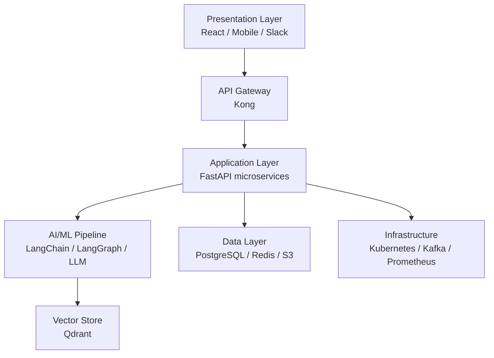
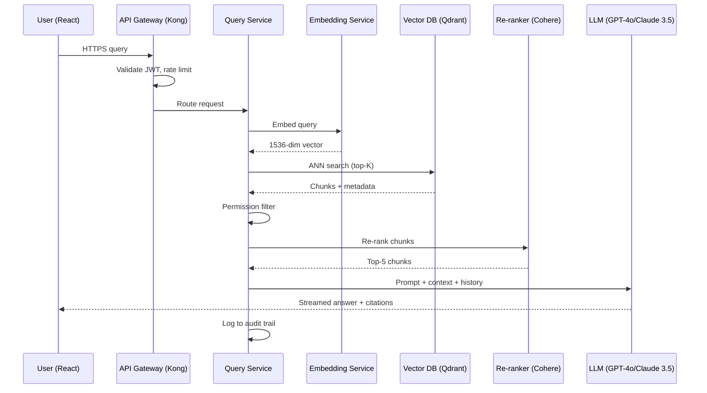
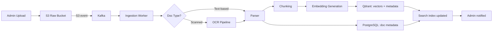

# Architecture — Enterprise AI Knowledge Assistant

> This document answers **HOW** the system is technically built. It distinguishes the **MVP architecture** (Phase 1) from the **recommended production/enterprise architecture** (Phases 2–5 and the "Final Recommended Architecture" section of the source). Where the source lists alternatives considered, those are marked accordingly and are not the selected implementation.

## 1. Architecture Overview

The system is composed of **7 major layers**, each independently scalable and replaceable:

| Layer | Components | Responsibility |
|---|---|---|
| Presentation Layer | React Web App, Mobile App, Slack Bot | User interface & interaction |
| API Gateway | Kong / AWS API Gateway | Auth, rate limiting, routing |
| Application Layer | FastAPI microservices | Business logic, orchestration |
| AI/ML Pipeline | LangChain, LLM, Embeddings | Semantic understanding & generation |
| Vector Store | Qdrant / Pinecone | Embedding storage & similarity search |
| Data Layer | PostgreSQL, Redis, S3 | Structured data, cache, file storage |
| Infrastructure | Kubernetes, Kafka, Prometheus | Orchestration, messaging, monitoring |



## 2. Architecture Principles (as implied by the source)

- Layers are independently scalable and replaceable.
- Client data must be logically isolated at every layer (see §4 Multi-Client Architecture).
- RBAC must be enforced at three levels simultaneously — never rely on a single layer.
- Asynchronous, queue-based processing for all non-real-time operations.
- Incremental adoption: build the MVP first, validate with real users, then adopt enterprise components — "you do not need to build everything at once."

## 3. Request Flows

### 3.1 User Query Flow (Runtime)

1. User types query in React frontend → HTTPS request to API Gateway
2. API Gateway validates JWT token, checks rate limits, routes to Query Service
3. Query Service calls Embedding Service → converts query to a 1536-dim vector
4. Vector DB (Qdrant) performs ANN (Approximate Nearest Neighbor) search
5. Top-K chunks retrieved with metadata (document ID, client, permissions)
6. Permission filter applied: user only sees docs they have access to
7. Re-ranker (Cohere) re-scores chunks by relevance to the original query
8. Context builder assembles system prompt + retrieved chunks + conversation history
9. LLM (GPT-4o / Claude 3.5) generates the answer with source citations
10. Response streamed back to user with source document links
11. Interaction logged to audit trail and analytics pipeline



### 3.2 Document Ingestion Flow (Background)

1. Admin uploads document via UI or API → stored in S3 raw bucket
2. S3 event triggers a Kafka message → consumed by Ingestion Worker
3. Document type detected (PDF, DOCX, Excel, image, etc.)
4. Appropriate parser extracts text + metadata
5. OCR pipeline activated if a scanned document is detected
6. Text chunked into 512-token segments with 50-token overlap (baseline; see §7 Chunking for strategy variants)
7. Each chunk converted to an embedding via OpenAI `text-embedding-3-large`
8. Embeddings + metadata stored in Qdrant with client namespace
9. Document metadata (name, client, version, tags) stored in PostgreSQL
10. Search index updated, admin notified of completion



## 4. Multi-Client Architecture

Client isolation is achieved through **namespace-based segregation at the vector database level** combined with **row-level security in PostgreSQL**:

- Each client gets a dedicated Qdrant collection (e.g., `client_acme_docs`, `client_globex_docs`)
- JWT token contains a `client_id` claim, enforced at every service boundary
- PostgreSQL Row Level Security policies filter all queries by `client_id`
- S3 bucket policies restrict file access by client prefix
- Redis cache keys are prefixed with `client_id` to prevent cross-contamination

**Security guarantee (source-stated):** client data is logically isolated at every layer; a user authenticated for Client A can never retrieve Client B's documents, even with a crafted query.

### Multi-Tenant Namespace Strategy (Vector DB level)

| Strategy | Implementation | Isolation Level | Use When |
|---|---|---|---|
| Collection-per-client | Separate Qdrant collection per client | Strong — complete separation | High-security, compliance requirements |
| Filter-per-client | Single collection, filter by `client_id` payload | Logical — shared infrastructure | Cost optimization, 10+ clients |
| Hybrid (recommended) | Collection per client tier, filter within | Strong + scalable | Enterprise production |

## 5. Authentication & RBAC

### 5.1 Roles

| Role | Permissions | Use Case |
|---|---|---|
| Super Admin | Full system access, client management | Platform operators |
| Client Admin | Manage client users, upload docs, view analytics | Client IT administrators |
| Knowledge Manager | Upload/delete/tag documents, manage glossary | Documentation owners |
| Power User | Search all client docs, export, view sources | Senior staff |
| Standard User | Search within assigned projects | Regular employees |
| Read Only | View search results only, no export | External stakeholders |
| New Joiner | Guided onboarding flow, limited scope | Recently hired staff |

### 5.2 Auth Technology

| Feature | Technology | Details |
|---|---|---|
| SSO (Single Sign-On) | SAML 2.0 / OIDC via Auth0 | Integrate with Azure AD, Okta, Google Workspace |
| MFA | TOTP + SMS + Hardware keys | Enforced for admin roles, optional for users |
| OAuth 2.0 | Auth0 with PKCE flow | For external integrations (Slack, Teams, APIs) |
| JWT Tokens | RS256-signed, 15-min expiry | Access token + refresh token rotation |
| Session Management | Redis-backed, forced logout | Admin can invalidate all user sessions instantly |
| Password Policy | Min 12 chars, complexity, breach check | Have I Been Pwned API integration |

### 5.3 RBAC Enforcement — Three Layers (mandatory, all three)

1. **API Gateway Level** — Kong validates JWT and checks role claims before routing
2. **Application Level** — FastAPI dependency injection checks permissions per endpoint
3. **Database Level** — PostgreSQL Row Level Security policies enforce `client_id` isolation

## 6. Technology Stack

Selected technology for each category, with alternatives considered (**not selected**) and the stated rationale:

| Category | Selected Technology | Alternatives Considered | Why Selected |
|---|---|---|---|
| Frontend | React + TypeScript + Vite | Vue, Angular, Next.js | Ecosystem maturity, component libraries, streaming support |
| UI Components | shadcn/ui + Tailwind CSS | MUI, Chakra UI | Headless, fully customizable, production-grade |
| Backend Framework | FastAPI (Python) | Django, Node.js, Go | Async native, OpenAPI auto-docs, Python AI ecosystem |
| AI Framework | LangChain + LangGraph | LlamaIndex, Haystack | Most mature, best RAG support, agent workflows |
| LLM (Primary) | OpenAI GPT-4o | Claude 3.5, Gemini 1.5 | Best instruction following, JSON mode, function calling |
| LLM (Fallback) | Anthropic Claude 3.5 Sonnet | Mistral Large, Llama 3 | Redundancy, different reasoning style |
| Embeddings | OpenAI `text-embedding-3-large` | Cohere, E5-large, BGE | Best MTEB scores, multilingual, 3072 dims |
| Vector Database | Qdrant | Pinecone, Weaviate, Chroma | Open source, self-hostable, hybrid search built-in |
| Primary Database | PostgreSQL 16 | MySQL, CockroachDB | ACID, JSONB, RLS, pgvector fallback |
| Cache | Redis 7 (Cluster) | Memcached, DragonflyDB | Pub/sub, session store, semantic cache |
| Message Queue | Apache Kafka | RabbitMQ, AWS SQS | High throughput, replay capability, partitioning |
| Object Storage | AWS S3 (+ MinIO dev) | GCS, Azure Blob | Industry standard, lifecycle policies, presigned URLs |
| OCR | AWS Textract + Tesseract | Google Cloud Vision, Azure DI | Textract for production quality, Tesseract for offline |
| Authentication | Auth0 + JWT | Keycloak, Okta, Cognito | SSO, MFA, social login, enterprise SAML out of box |
| API Gateway | Kong | AWS API Gateway, Traefik | Rate limiting, plugins, auth middleware, analytics |
| Container Orchestration | Kubernetes (EKS) | ECS, Nomad, Swarm | Industry standard, autoscaling, service mesh |
| CI/CD | GitHub Actions + ArgoCD | Jenkins, GitLab CI | GitOps workflow, declarative deployments |
| Monitoring | Prometheus + Grafana | Datadog, New Relic | Open source, cost-effective, extensive dashboards |
| Logging | ELK Stack (Elasticsearch + Kibana) | Loki, Splunk, CloudWatch | Full-text log search, dashboards, alerting |
| Tracing | Jaeger (OpenTelemetry) | Zipkin, AWS X-Ray | Distributed tracing, latency visualization |
| Re-ranking | Cohere Rerank v3 | Cross-encoder local, BGE reranker | Best-in-class reranking, multilingual, API-based |
| Document Parsing | Apache Tika + LlamaParse | Unstructured.io, Docling | Format breadth + LlamaParse for complex PDFs |
| Search (Hybrid) | Qdrant + BM25 (built-in) | Elasticsearch hybrid, Vespa | Single system for both dense + sparse vectors |

## 7. AI/LLM & RAG Architecture

The RAG pipeline has **6 critical stages**:

### Stage 1: Document Chunking Strategy

> Chunking is the most underestimated factor in RAG quality. Poor chunking = poor retrieval = poor answers.

| Strategy | Best For | Chunk Size | Overlap | Notes |
|---|---|---|---|---|
| Fixed Token | Simple text docs | 512 tokens | 50 tokens | Fast, baseline quality |
| Recursive Character | General purpose | 500–1000 chars | 100 chars | Respects sentence boundaries |
| Semantic Chunking | Technical docs | Variable | Sentence-aware | Best quality, slower |
| Parent-Child | Long reports | Parent: 2048, Child: 256 | Parent retrieval | Small chunk find, large chunk read |
| Structural | HTML/Markdown | Section-based | Header context | Preserves document structure |

**Recommended:** Parent-Child chunking for reports, Semantic chunking for technical documentation, Structural chunking for HTML/Markdown. Never use one strategy for all document types.

### Stage 2: Embedding Generation

- Model selection: `text-embedding-3-large` (3072 dims) for highest accuracy; `text-embedding-3-small` for cost/speed tradeoff
- Batch processing: send chunks in batches of 100–500 to minimize API latency and cost
- Caching: cache embeddings in Redis for identical text to avoid redundant API calls
- Multilingual: `multilingual-e5-large-instruct` for multi-language documents
- Dimensionality reduction: Matryoshka embeddings allow truncation (3072→512) for storage savings

### Stage 3: Hybrid Search

- Dense search: cosine similarity on embeddings — finds semantically similar content
- Sparse search: BM25 on raw text — finds exact keyword matches, acronyms, IDs
- Reciprocal Rank Fusion (RRF): combines ranked results from both methods
- Weight tuning: `alpha = 0.7` dense + `0.3` sparse works well for technical documentation

**Critical (source-stated):** Hybrid search outperforms pure semantic search by 15–25% on technical documentation benchmarks — never use semantic-only in production.

### Stage 4: Re-ranking

- Initial retrieval returns top-20 candidates; re-ranking selects the best top-5 for LLM context
- Cross-encoder model evaluates the query-document pair together (vs bi-encoder used in retrieval)
- Cohere Rerank v3: ~40ms latency, multilingual, best BEIR benchmark scores
- Pipeline: retrieve top-20 → rerank → select top-5 → inject into LLM

### Stage 5: Context Assembly & Prompt Engineering

- System prompt: defines assistant persona, response format, citation style
- Conversation history: last 5 turns (sliding window) for context continuity
- Retrieved chunks: sorted by relevance score, with source metadata
- User query: reformulated if needed for multi-query retrieval
- Output format instructions: JSON for structured queries, markdown for explanations

### Stage 6: Hallucination Prevention

| Technique | How It Works | Effectiveness |
|---|---|---|
| Grounded prompting | Instruct LLM to only answer from provided context | High |
| Source citation enforcement | Require `[Source: doc_id]` in every factual claim | Medium-High |
| Confidence scoring | LLM rates its own confidence; low scores trigger retrieval retry | Medium |
| Factual consistency check | Secondary LLM validates answer against retrieved chunks | High (expensive) |
| Retrieval quality gate | Minimum similarity threshold; refuse if no relevant docs found | High |
| Answer grounding score | NLI model checks if answer is entailed by context | High |

### 7.1 Advanced AI Features

**Multi-Query Retrieval:** for complex questions, generate 3–5 query variations automatically, retrieve for each, then deduplicate and merge results (LangChain's `MultiQueryRetriever`). Increases recall by 30–40% for multi-aspect questions.

**Agentic Workflows (LangGraph)** — for complex tasks, an AI agent can:
- Route to specialized sub-agents (HR docs agent, Technical docs agent, Client-specific agent)
- Use tools: search documents, query databases, retrieve previous answers
- Plan multi-step reasoning: decompose complex questions into sub-questions
- Self-correct: detect low answer quality and re-retrieve

**Fine-tuning vs RAG — Decision Framework:**

| Scenario | Use RAG | Use Fine-tuning | Use Both |
|---|---|---|---|
| Company-specific knowledge | Primary approach | Optional boost | Best quality |
| Frequently updated docs | Always current | Stale quickly | Not needed |
| Style/tone customization | Not effective | Primary approach | N/A |
| Domain terminology | Partial (glossary) | Deeply internalized | Recommended |
| Cost sensitivity | No GPU needed | High GPU cost | Most expensive |

## 8. Document Ingestion Architecture

### 8.1 Supported File Types & Parsers

| File Type | Parser | Handles | Special Notes |
|---|---|---|---|
| PDF (text-based) | LlamaParse + PyMuPDF | Tables, headers, footers | Preserve table structure |
| PDF (scanned) | AWS Textract | Handwriting, stamps, forms | 95%+ accuracy on clear scans |
| DOCX/DOC | python-docx + pandoc | Styles, tables, track changes | Preserve heading hierarchy |
| Excel/XLSX | openpyxl + pandas | Multi-sheet, formulas, charts | Convert to structured text |
| PowerPoint | python-pptx | Slides, notes, speaker text | Extract per-slide content |
| HTML/Web | BeautifulSoup + Trafilatura | Main content extraction | Remove navigation/ads |
| Markdown | markdown-it | Code blocks, tables, lists | Preserve code formatting |
| Images (PNG/JPG) | AWS Textract + GPT-4V | Text in images, diagrams | Visual content description |
| CSV/TSV | pandas | Tabular data | Smart summarization |
| Email (MSG/EML) | email library + mailparser | Body, attachments, metadata | Extract thread context |

### 8.2 OCR Pipeline

1. Image preprocessing: deskew, denoise, contrast enhancement (OpenCV)
2. Page detection: identify text regions vs images vs tables
3. OCR engine selection: AWS Textract for complex layouts, Tesseract for simple text
4. Confidence scoring: flag low-confidence regions for human review
5. Post-processing: spelling correction with context, number formatting
6. Table detection: separate pipeline for structured table extraction

### 8.3 Metadata Extraction & Auto-Tagging

| Metadata Field | Source | Method |
|---|---|---|
| Document title | File name, H1 heading, PDF metadata | Rule-based + NLP extraction |
| Author | PDF metadata, DOCX properties, email header | Metadata parser |
| Creation date | File system, document properties | Metadata parser |
| Client/Project | Folder path, filename convention, content | Path rules + LLM classification |
| Document type | Content analysis | LLM zero-shot classification |
| Topics/Tags | Full text analysis | KeyBERT + LLM topic extraction |
| Language | Text sample | langdetect library |
| Summary | Full document | LLM abstractive summarization |
| Key entities | Full text | spaCy NER + LLM extraction |
| Sensitivity level | Content patterns + LLM | PII detection + classification |

### 8.4 Document Versioning & Incremental Indexing

- Each document version stored immutably in S3 with `version_id`
- SHA-256 hash computed on upload — identical files skipped (deduplication)
- Changed files: old embeddings soft-deleted, new embeddings generated
- Incremental indexing: only changed/new files processed on each sync cycle
- Real-time sync: S3 event notifications trigger immediate processing for new uploads
- Batch sync: nightly job reconciles filesystem with indexed state

## 9. Vector Database Architecture

### 9.1 Vector Database Comparison

| Database | Type | Hosting | Hybrid Search | Scale | Cost | Verdict |
|---|---|---|---|---|---|---|
| Pinecone | Managed cloud | SaaS only | External BM25 | 100M+ vecs | $$$ | Best managed, vendor lock-in |
| **Qdrant** | Open source | Self/Cloud | Built-in | 100M+ vecs | $-$$ | **RECOMMENDED for enterprise (selected)** |
| Weaviate | Open source | Self/Cloud | Built-in | 50M+ vecs | $-$$ | Good, complex config (alternative) |
| ChromaDB | Open source | Self only | No | 1M vecs | Free | Dev/prototype only (MVP-tier alternative) |
| FAISS | Library | Self only | No | Billions | Free | Research/batch, no live updates (not selected) |
| pgvector | PostgreSQL ext | Any PG host | Manual | 1M vecs | $ | Simple setups, not primary use (not selected) |

**Recommendation (source-stated):** Use Qdrant for production. It provides hybrid search, HNSW indexing, payload filtering, multi-tenancy, and can be self-hosted on Kubernetes for data sovereignty. ChromaDB is called out specifically as the low-budget **MVP** vector DB option (see §12).

### 9.2 Qdrant Schema Design (payload example)

```json
{
  "id": "uuid-v4",
  "vector": [0.23, -0.87, "..."],
  "payload": {
    "chunk_text": "The system latency was measured at...",
    "document_id": "doc_abc123",
    "document_title": "Performance Report Q3 2024",
    "client_id": "client_acme",
    "project_id": "proj_platform_v2",
    "chunk_index": 4,
    "page_number": 12,
    "file_type": "pdf",
    "author": "Jane Smith",
    "created_at": "2024-03-15T10:30:00Z",
    "tags": ["performance", "latency", "monitoring"],
    "language": "en",
    "sensitivity": "internal",
    "section_heading": "3.2 System Performance Metrics"
  }
}
```

### 9.3 Similarity Search Methods

- **HNSW** (Hierarchical Navigable Small World): default indexing algorithm, O(log n) query time, 95%+ recall at 100ms
- **Cosine Similarity**: for text embeddings (unit-normalized vectors) — measures angular distance
- **Dot Product**: faster than cosine for non-normalized vectors, used for asymmetric queries
- **Euclidean Distance**: used for image embeddings and continuous value representations
- **Quantization**: Scalar or Product quantization reduces memory 4–16x with <5% recall loss

## 10. Database Design (PostgreSQL)

### `clients`
```sql
CREATE TABLE clients (
  id            UUID PRIMARY KEY DEFAULT gen_random_uuid(),
  name          VARCHAR(255) NOT NULL,
  slug          VARCHAR(100) UNIQUE NOT NULL,
  plan_tier     VARCHAR(50) DEFAULT 'standard',
  settings      JSONB DEFAULT '{}',
  created_at    TIMESTAMPTZ DEFAULT NOW(),
  is_active     BOOLEAN DEFAULT TRUE
);
```

### `users`
```sql
CREATE TABLE users (
  id            UUID PRIMARY KEY DEFAULT gen_random_uuid(),
  client_id     UUID REFERENCES clients(id) ON DELETE CASCADE,
  email         VARCHAR(255) UNIQUE NOT NULL,
  full_name     VARCHAR(255),
  role          VARCHAR(50) NOT NULL DEFAULT 'standard_user',
  auth_provider VARCHAR(50) DEFAULT 'auth0',
  auth_sub      VARCHAR(255) UNIQUE,
  last_login    TIMESTAMPTZ,
  is_active     BOOLEAN DEFAULT TRUE,
  created_at    TIMESTAMPTZ DEFAULT NOW()
);
CREATE INDEX idx_users_client ON users(client_id);
ALTER TABLE users ENABLE ROW LEVEL SECURITY;
CREATE POLICY user_isolation ON users
  USING (client_id = current_setting('app.current_client_id')::UUID);
```

### `documents`
```sql
CREATE TABLE documents (
  id              UUID PRIMARY KEY DEFAULT gen_random_uuid(),
  client_id       UUID REFERENCES clients(id) ON DELETE CASCADE,
  project_id      UUID REFERENCES projects(id),
  title           VARCHAR(500),
  file_name       VARCHAR(500) NOT NULL,
  file_type       VARCHAR(50),
  file_size       BIGINT,
  s3_key          VARCHAR(1000) NOT NULL,
  s3_version_id   VARCHAR(255),
  content_hash    VARCHAR(64),
  status          VARCHAR(50) DEFAULT 'pending',
  language        VARCHAR(10) DEFAULT 'en',
  page_count      INT,
  summary         TEXT,
  sensitivity     VARCHAR(50) DEFAULT 'internal',
  indexed_at      TIMESTAMPTZ,
  created_by      UUID REFERENCES users(id),
  created_at      TIMESTAMPTZ DEFAULT NOW(),
  updated_at      TIMESTAMPTZ DEFAULT NOW(),
  metadata        JSONB DEFAULT '{}'
);
CREATE INDEX idx_docs_client ON documents(client_id);
CREATE INDEX idx_docs_status ON documents(status);
CREATE INDEX idx_docs_hash ON documents(content_hash);
```

> Note: `documents` references a `projects` table which is not otherwise defined in the source documentation — not specified in the source documentation.

### `conversations` & `messages`
```sql
CREATE TABLE conversations (
  id            UUID PRIMARY KEY DEFAULT gen_random_uuid(),
  user_id       UUID REFERENCES users(id),
  client_id     UUID REFERENCES clients(id),
  title         VARCHAR(500),
  created_at    TIMESTAMPTZ DEFAULT NOW()
);

CREATE TABLE messages (
  id              UUID PRIMARY KEY DEFAULT gen_random_uuid(),
  conversation_id UUID REFERENCES conversations(id) ON DELETE CASCADE,
  role            VARCHAR(20) NOT NULL,  -- 'user' | 'assistant' | 'system'
  content         TEXT NOT NULL,
  sources         JSONB,  -- array of {doc_id, chunk_id, score, excerpt}
  latency_ms      INT,
  token_count     INT,
  model_used      VARCHAR(100),
  created_at      TIMESTAMPTZ DEFAULT NOW()
);
```

### `audit_logs`
```sql
CREATE TABLE audit_logs (
  id            BIGSERIAL PRIMARY KEY,
  client_id     UUID,
  user_id       UUID,
  action        VARCHAR(100) NOT NULL,
  resource_type VARCHAR(100),
  resource_id   UUID,
  details       JSONB,
  ip_address    INET,
  user_agent    VARCHAR(500),
  created_at    TIMESTAMPTZ DEFAULT NOW()
);
-- Partition by month for performance
CREATE TABLE audit_logs_2025_01 PARTITION OF audit_logs
  FOR VALUES FROM ('2025-01-01') TO ('2025-02-01');
```

## 11. Microservices / Application Architecture

| Service | Responsibility | Language | Scale Strategy |
|---|---|---|---|
| API Gateway | Auth, routing, rate limiting | Kong (Lua) | Horizontal, stateless |
| Query Service | Handle user queries, orchestrate RAG | Python/FastAPI | Horizontal, stateless |
| Ingestion Service | Process uploaded documents | Python/FastAPI | Horizontal + GPU nodes |
| Embedding Service | Generate vector embeddings | Python/FastAPI | Horizontal, cached |
| LLM Proxy Service | Manage LLM calls, fallbacks, caching | Python/FastAPI | Horizontal, semantic cache |
| Search Service | Execute vector + keyword search | Python/FastAPI | Horizontal, read replicas |
| Auth Service | Auth0 integration, JWT validation | Node.js | Horizontal, stateless |
| Notification Service | Email, Slack, webhook delivery | Go | Horizontal, queue-backed |
| Analytics Service | Usage metrics, search quality | Python | Single replica, offline |
| Admin Service | User/client/doc management | Python/FastAPI | Low scale, admin use only |

## 12. Infrastructure & Deployment

### 12.1 Kubernetes Deployment Strategy
- Namespace per environment: dev, staging, production
- HorizontalPodAutoscaler on CPU/memory for query and ingestion services
- VerticalPodAutoscaler for right-sizing resource requests
- PodDisruptionBudgets to ensure 99.9% uptime during rollouts
- Spot/Preemptible nodes for ingestion workers (fault-tolerant batch jobs)
- GPU node pools (p3.2xlarge) for local embedding models
- Istio service mesh for mTLS between services, traffic management, observability

### 12.2 Queue-Based Async Processing (Kafka)
- Document ingestion: decoupled upload from processing, handles traffic spikes
- Embedding generation: batched for cost efficiency, retried on failure
- Notification delivery: fire-and-forget, doesn't block user operations
- Analytics events: high-volume, low-priority, buffered in Kafka
- Dead letter queue: failed messages captured, alerted, reprocessed manually

### 12.3 Caching Strategy

| Cache Layer | What's Cached | TTL | Technology |
|---|---|---|---|
| Semantic query cache | LLM responses for similar queries | 24 hours | Redis + GPTCache |
| Embedding cache | Embeddings for repeated text | Permanent | Redis Hash |
| Search result cache | Top results for popular queries | 1 hour | Redis |
| User session cache | Auth tokens, permissions | 15 minutes | Redis |
| Document metadata cache | Title, tags, permissions | 30 minutes | Redis |
| CDN cache | Static assets, avatars | 7 days | CloudFront |

### 12.4 Observability
- **Monitoring:** Prometheus + Grafana
- **Logging:** ELK Stack (Elasticsearch + Kibana)
- **Tracing:** Jaeger (OpenTelemetry)

### 12.5 MVP Deployment (Phase 1) vs Production Deployment

| Component | MVP (Low Budget) | Mid-Scale Production | Enterprise Scale |
|---|---|---|---|
| Frontend | React + Vite + Tailwind | React + TypeScript + shadcn/ui | Same + micro-frontend arch |
| Backend | Single FastAPI app | FastAPI microservices | FastAPI + Go services |
| LLM | GPT-4o-mini (cheapest) | GPT-4o + Claude fallback | Azure OpenAI (data residency) |
| Embeddings | text-embedding-3-small | text-embedding-3-large | Same + local fallback (E5) |
| Vector DB | ChromaDB (local) | Qdrant (self-hosted K8s) | Qdrant cluster + read replicas |
| Database | PostgreSQL (single node) | PostgreSQL (RDS Multi-AZ) | Aurora PostgreSQL serverless |
| Cache | Redis (single) | Redis Cluster | ElastiCache Redis Global |
| Queue | Celery + Redis | Kafka (MSK) | Kafka multi-region |
| Auth | Auth0 free tier | Auth0 B2B Essentials | Auth0 Enterprise / Okta |
| Deployment | Docker Compose + 1 VM | EKS 3–8 nodes | Multi-region EKS + Istio |
| Monthly Infra Cost | ~$100–300 | ~$2,000–5,000 | ~$15,000–50,000 |

> Note: this table (from the source's "Final Recommended Architecture") differs in specific technology names (e.g. ChromaDB, GPT-4o-mini, Celery+Redis for MVP) from the primary "Technology Stack" table in §6, which describes the general/production-oriented selected stack (Qdrant, GPT-4o, Kafka). Per the source, §6 is the general selected stack; this table is the budget/scale-tiered recommendation — both are presented as authoritative for their respective context and are not contradictory, but should not be conflated: use this table when scoping by budget/scale, and §6 when referencing the general production stack.

## 13. Security Architecture

### 13.1 Data Security

| Layer | Mechanism | Standard |
|---|---|---|
| Data in transit | TLS 1.3 everywhere | FIPS 140-2 |
| Data at rest (S3) | AES-256 server-side encryption | SSE-S3 + optional KMS |
| Data at rest (DB) | PostgreSQL TDE + encrypted backups | AES-256 |
| Data at rest (vectors) | Qdrant payload encryption | AES-256 |
| API keys | Vault (HashiCorp) secret management | Rotation every 90 days |
| PII detection | AWS Macie + custom NLP patterns | GDPR Article 25 |
| LLM data privacy | No training on customer data (API contract) | OpenAI Enterprise / Azure OpenAI |

### 13.2 Audit Logging
- User queries: timestamp, user_id, client_id, query text, documents retrieved
- Document access: who viewed which document, when, from which IP
- Admin actions: permission changes, user creation, document deletion
- Failed auth attempts: IP, user agent, frequency — triggers auto-block after 5 failures
- Export events: when data is exported, by whom, what data
- Retention: 7 years for compliance, stored in immutable S3 bucket with Object Lock

### 13.3 Compliance

| Regulation | Requirement | Implementation |
|---|---|---|
| GDPR | Right to erasure, data minimization | Hard delete API + PII scrubbing pipeline |
| SOC 2 Type II | Security, availability, confidentiality | Annual audit, penetration testing |
| ISO 27001 | Information security management | Policy framework, risk assessment |
| HIPAA (if healthcare) | PHI protection, access controls | BAA with cloud providers, encryption at rest |
| Data Residency | Data stays in specific geography | AWS region pinning, no cross-region replication |

## 14. Architecture Trade-offs / Decision Records

| Decision | Option A | Option B | Recommendation |
|---|---|---|---|
| Vector DB | Pinecone (managed) | Qdrant (self-hosted) | Qdrant: cost savings, data control, feature parity |
| LLM Provider | OpenAI only | Multi-provider (OpenAI + Anthropic) | Multi-provider: resilience, cost optimization |
| Hosting LLMs | API-based (OpenAI) | Self-hosted (Llama 3) | API for most; self-host only if data leaves country |
| Chunking | Fixed token size | Semantic + parent-child | Semantic: 20–30% better retrieval quality |
| Search | Semantic only | Hybrid (semantic + BM25) | Hybrid: always better in production, minimal cost |
| Auth | Build custom | Auth0 / Okta managed | Managed: faster delivery, enterprise features OOB |

## 15. Final Technical Recommendation (source-stated priorities)

1. **Deploy hybrid search with Qdrant + re-ranking** — Week 1–8 — highest priority, 60–70% search quality improvement
2. **Implement parent-child chunking for all documents** — Week 4–10 — 20–30% additional quality improvement
3. **Company glossary + query expansion** — Week 6–12 — critical for new joiner adoption
4. **Conversation memory + source citations** — Month 3–6 — chatbot usability, trust building
5. **Multi-client RBAC + audit logging** — Month 4–7 — enterprise sales enablement
6. **LangGraph agents + Graph RAG** — Month 12+ — strategic differentiation (long-term)

The single most impactful technical decision, per the source, is implementing Hybrid Search (semantic + BM25) with Re-ranking from Day 1. The second most impactful is proper chunking strategy — poor chunking is called out as the #1 cause of poor RAG quality.

## 16. Future Architecture (Phase 5 and beyond)

- LangGraph multi-agent router (department-specialized agents)
- Graph RAG (Neo4j + LangChain GraphRAG) for relationship-aware, multi-hop search
- Retrieval quality auto-improvement via an RLHF pipeline from user feedback
- Multi-modal search (GPT-4V + CLIP embeddings)
- Internal Copilot SDK (REST API + webhooks) for teams to build domain-specific assistants

Disaster recovery: **Not specified in the source documentation.**
